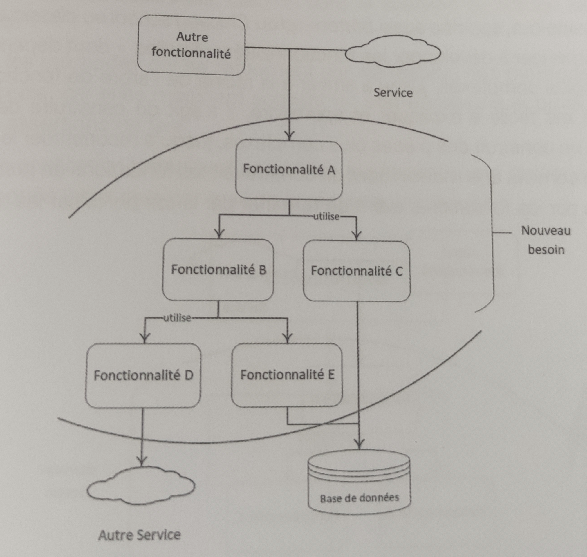

Styles de TDD
================================================================

## Introduction

Il existe deux styles principaux de TDD, qui sont parfois considérés comme des écoles différentes : le style Inside Out, aussi appelé Chicago School, et le style Outside In, aussi appelé London School. Une façon de préparer le développement d'une nouvelle fonctionnalité est de dessiner des boîtes au tableau pour représenter les fonctionnalités à créer et les dépendances entre elles. On imagine ainsi la première fonctionnalité à mettre en place avec son point d'entrée, puis le deuxième, puis le troisième, et ainsi de suite.

Une fois le diagramme terminé au moment de débuter le développement, une question se pose : par où commencer dans cet arbre de fonctionnalités qui deviendra un arbre d'appel entre composants ? À terme, on peut très bien commencer par les feuilles, c'est-à-dire les fonctionnalités C, D ou E, ou bien par la racine, la fonctionnalité A.

## Combinaison des Approches

Les deux approches ne sont pas nécessairement exclusives. Il est parfois possible de les combiner, comme décrit dans un exemple inspiré du kata banking, considérant une fonctionnalité de relevé de compte bancaire avec une méthode pour imprimer le relevé de compte qui liste chaque mouvement avec la date et le solde.

Sur un mois donné, on peut décomposer cette fonctionnalité d'affichage du relevé de compte en un arbre de fonctionnalités avec à la racine la fonctionnalité du relevé de compte complète. Elle affiche le relevé qui rassemble les infos des mouvements, la date, le montant et le solde correspondant. Cette fonctionnalité peut, à son tour, se décomposer en plusieurs sous-fonctionnalités telles que :

- Accéder à la liste de tous les mouvements du mois
- Calculer le nouveau solde pour chaque ligne
- Accéder à la liste de tous les mouvements de l'année
- Filtrer les mouvements du mois sélectionné

En fonction du contexte et de l'affinité avec chaque approche, le choix peut varier. La combinaison des deux approches permet une approche plus flexible du développement basée sur le contexte spécifique du projet.