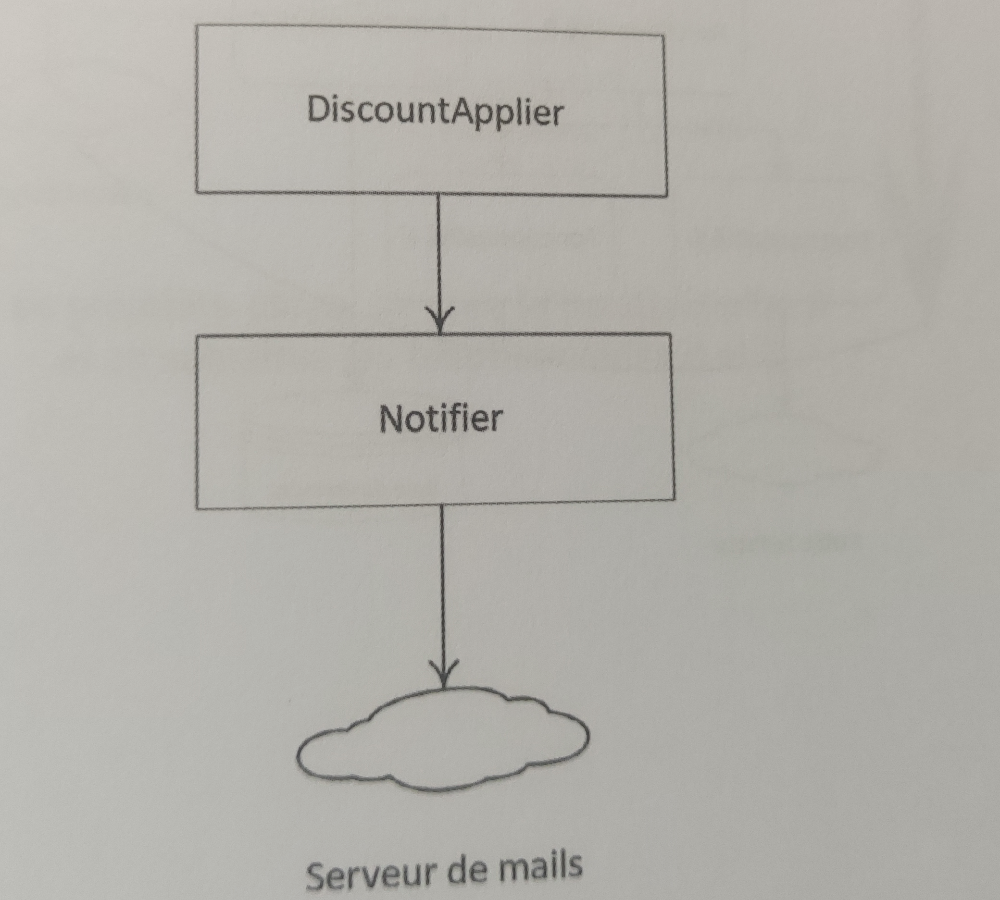

Style de TDD - Inside Out
================================================================

## Introduction

L'approche Inside Out, appelée aussi **Bottom Up** ou **Chicago School** ou **Classic approach**, consiste à commencer à développer les fonctionnalités de base, dont dépendent des fonctionnalités plus complexes, jusqu'à arriver à la racine de l'arbre des fonctionnalités. Cette approche est facile à expliquer et à prendre en main.

Il s'agit de construire des pièces avec lesquelles on construit des pièces plus complexes, jusqu'à reconstituer le système attendu. Un peu comme une maison dont on construirait d'abord les fondations, puis les murs portés par la fondation avant de terminer par le toit porté par les murs.

## Exemple

Dans l'exemple du relevé de compte bancaire, notre point de départ en TDD Inside Out sera l'une des fonctionnalités de plus bas niveau. Par exemple, le filtrage des mouvements.

Étant donné une liste de mouvements:

* 03/01/2023 | -50
* 03/03/2023 | 10
* 04/03/2023 | -20

Quand on filtre les mouvements pour le mois de mars, on obtient la liste des mouvements filtrés suivante : 

* 03/03/2023 | 10
* 04/03/2023 | -20

Et ainsi de suite pour les autres fonctionnalités : accéder à la liste de tous les mouvements de l'année, calculer le nouveau solde pour chaque ligne, puis enfin afficher le relevé.

## Approche de Test

Idéalement, chaque sous-fonctionnalité est développée en relation avec des tests unitaires qui vérifient le résultat en sortie de l'évaluation par des assertions, comme dans le scénario de filtrage de mouvement précédent. Tester les méthodes qui ne retournent pas de résultat, les méthodes void, est moins simple car elles modifient souvent un état encapsulé et privé, donc inaccessible aux assertions de tests.

Dans l'exemple d'une application avec un service appliquant une réduction sur un article, puis notifiant les clients par e-mail de la réduction appliquée, en Inside Out, on implémente d'abord le notifier, puis l'application de réduction pour tester le notifier.

## Utilisation de Mocks

Il pourrait être tentant d'exposer ses attributs privés pour vérifier le résultat de l'appel tout en désactivant l'envoi réel. Une meilleure alternative est d'utiliser un mock qui remplace la classe collaboratrice, comme un SMTP mock, soit avec un framework de mocks, soit avec un mock manuel en utilisant une simple sous-classe qui va vérifier qu'elle est appelée comme désirée. Le service d'envoi de mails peut aussi être implémenté ultérieurement en utilisant un mock qui le remplace.