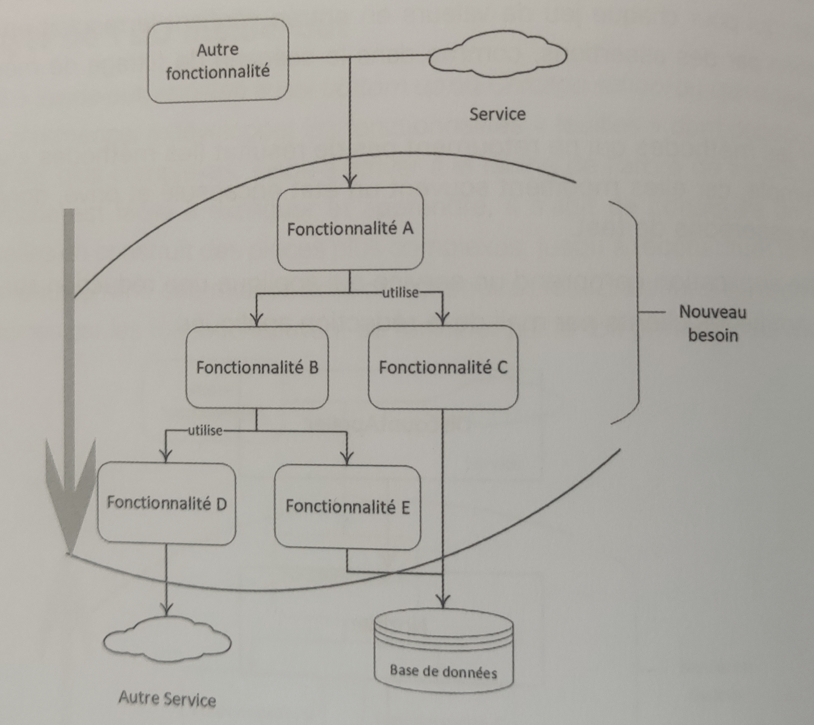
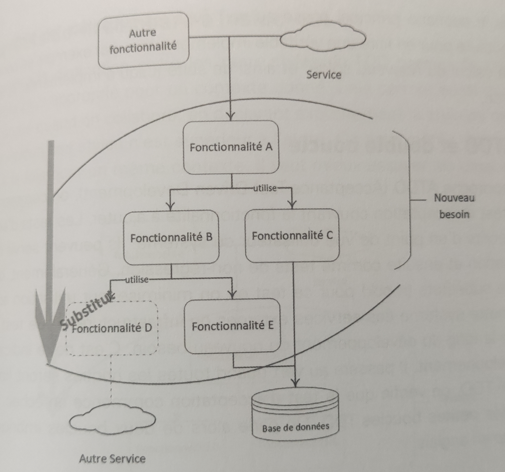

Style de TDD - Outside In
================================================================

## Introduction

L'approche Outside In, également appelée **Top Down** ou **London School**, ou **Mock approach**, met l'accent sur le besoin de l'utilisateur. Elle nécessite une décomposition préalable du problème en éléments plus simples qui seront remplacés temporairement par des substituts avant d'être finalement construits.

Dans cette approche, le développement est guidé par le besoin de l'extérieur vers l'intérieur. Cela ne signifie pas nécessairement de devoir tout considérer à partir de l'interface graphique de l'application. On peut également l'utiliser pour une fonctionnalité dont le point d'entrée est une API ou l'interface d'un service un peu complexe.

## Processus de Développement

Les composants techniques sont créés au fur et à mesure de la progression vers les feuilles de l'arbre des fonctionnalités. À chaque itération, on va substituer les composants non encore créés.

Par exemple, en première étape, on crée la fonctionnalité A et on substitue les fonctionnalités B et C.

Ensuite, on passe à la fonctionnalité C et éventuellement à la fonctionnalité B, selon les besoins.

En troisième étape, on implémente la fonctionnalité B en substituant les fonctionnalités qu'elle utilise, comme D et E.

En quatrième étape, on implémente la fonctionnalité E, par exemple.

Finalement, on implémente la fonctionnalité des avec un usage aussi intensif de doublure de tests.

Il est important de vérifier à la fin qu'il existe une implémentation de chaque substitut utilisé. Cela peut se faire manuellement, mais pour plus de fiabilité, la méthode TDD Acceptance Test Drive Development est recommandée.

## Exemple

Un exemple concret de cette approche pourrait être la fonctionnalité du relevé de compte. En TDD Outside In, on commence par décomposer la fonctionnalité en sous-fonctionnalités. Par exemple, on pourrait commencer par implémenter l'affichage du relevé avec des substituts de tests correspondant à l'accès à la liste des mouvements du mois et au calcul du solde correspondant à chaque ligne.

Une fois le scénario principal passé avec succès, on convertit chaque substitut en une véritable implémentation, en commençant par le calcul du nouveau solde, et ainsi de suite jusqu'à implémenter la totalité du problème.