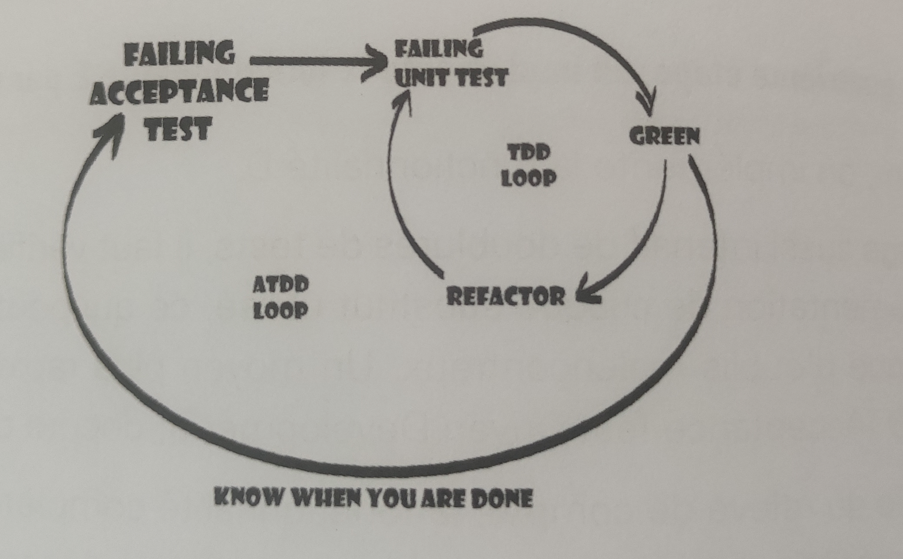
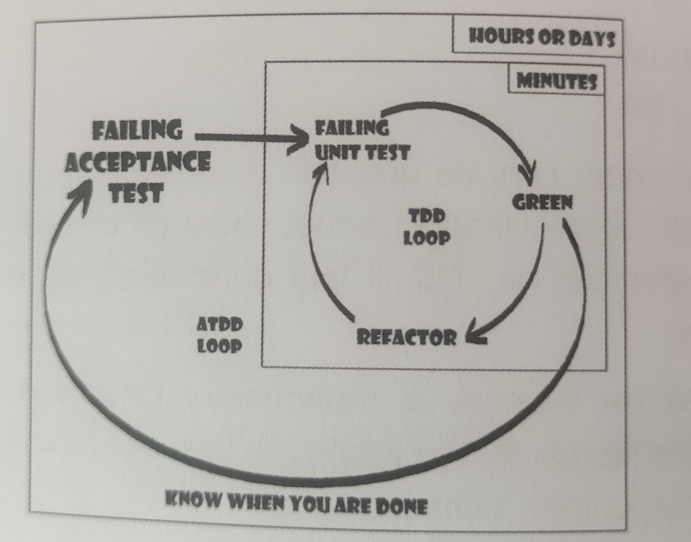

ATDD et double boucle
================================================================

## Introduction à ATDD

Dans l'approche **ATDD** (Acceptance Test Drive Development), on commence par écrire un test d'acceptation couvrant la fonctionnalité à ajouter. Les tests d'acceptation sont écrits du point de vue de l'utilisateur du système. Ils peuvent servir de documentation et ensuite comme test de non-régression. Généralement, on n'utilise pas de substitut pour ce test, ou bien on minimise leur utilisation aux frontières de notre système, comme les services externes ou les infrastructures.

Ce test restera rouge tout au long du développement du nouveau besoin. Il passera au vert quand toutes les briques seront finalisées. Comme en TDD, on vérifie que le test d'acceptation commence en échec, puis on démarre des petites boucles TDD. On parle alors de deux boucles imbriquées ou double boucle en anglais.

## Processus de Développement

Comme vu dans le chapitre précédent sur le TDD, les tests ne doivent jamais rester rouges en échec pendant une longue période. Cependant, en **ATDD**, la boucle est plus grande. Tant qu'on n'a pas fini la fonctionnalité, le test d'acceptation reste rouge. Certains frameworks permettent de marquer des tests en cours (_pending_) pour ne pas créer d'alertes ou d'inquiétudes inutiles, car la durée de vie de la Grande Boucle est généralement de quelques heures, voire quelques jours.

