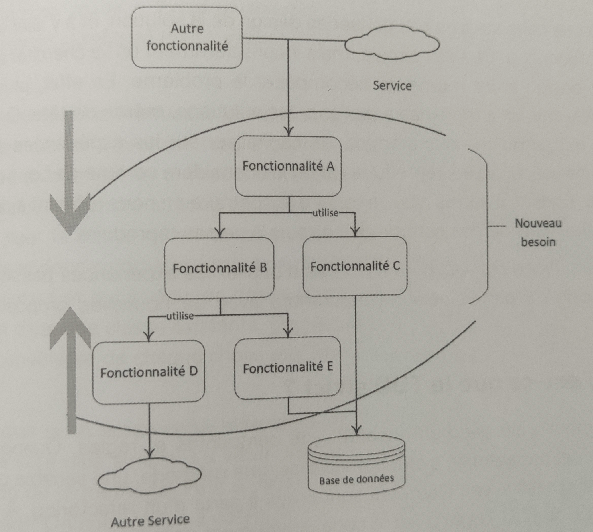

Outside-in comparé à Inside-out
================================================================

## Comparaison de l'approche Outside In et Inside Out

Lorsqu'on aborde le développement orienté par les tests (**TDD**), il est crucial de connaître la distinction entre les deux styles, à savoir **Outside In** et **Inside Out**. Cette connaissance permet de choisir celui qui convient le mieux à un contexte donné. De plus, elle favorise une meilleure compréhension lorsqu'on collabore en explicitant clairement le style qu'on souhaite adopter.

Il est important de noter qu'aucun des deux styles n'est supérieur à l'autre. Dans certaines situations, il peut même être utile d'utiliser les deux styles simultanément. Pour un même projet ou contexte, il est recommandé d'expérimenter les deux approches afin de mieux évaluer leur efficacité respective.

